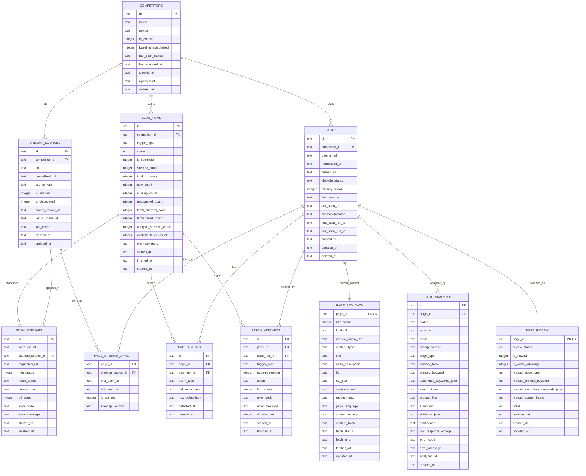

# Sitemap Crawl 数据模型与 ERD

## 1. 设计原则

1. 同一竞品的同一标准化 URL 只保存一条页面主记录。
2. 不保存每日全量 URL 快照。
3. 不保存完整 Sitemap XML 和完整网页 HTML。
4. 当前状态与历史事件分开保存。
5. AI 原始结果、人工修订结果分开保存。
6. 所有时间统一以 UTC 写入数据库，界面按 `Asia/Shanghai` 展示。
7. 数据库目标为 Cloudflare D1，字段与查询应兼容 SQLite。

## 2. ERD



## 3. 表说明

## 3.1 `competitors`

保存竞品级配置和当前扫描摘要。

| 字段 | 类型 | 说明 |
|---|---|---|
| `id` | TEXT PK | UUID/ULID |
| `name` | TEXT | 后台展示名称 |
| `domain` | TEXT | 规范化主域名，不含路径 |
| `is_enabled` | INTEGER | 0/1 |
| `baseline_established` | INTEGER | 首次完整基线是否成功 |
| `last_scan_status` | TEXT | 最近一次扫描状态 |
| `last_scanned_at` | TEXT | UTC ISO 8601 |
| `deleted_at` | TEXT NULL | 软删除时间 |

约束：

- `domain` 建议唯一；
- 域名必须在服务端规范化并校验；
- 软删除记录默认不参与扫描。

## 3.2 `sitemap_sources`

保存手动配置和自动发现的 Sitemap。

`source_type` 建议值：

- `manual`
- `robots`
- `common_path`
- `sitemap_index_child`

关键约束：

```sql
UNIQUE (competitor_id, normalized_url)
```

`parent_source_id` 用于表示 Sitemap Index 与子 Sitemap 的关系。实现时必须设置最大递归深度和 visited 集合，避免循环引用。

## 3.3 `scan_runs`

每次竞品扫描只保存一条汇总记录。

`trigger_type`：

- `cron`
- `manual`
- `retry`

`status`：

- `queued`
- `running`
- `success`
- `partial_success`
- `failed`

`is_complete` 是缺失判断的关键字段。只有确认获取了所有启用 Sitemap 且 URL 集合完整时才为 1。失败或不完整扫描不得更新页面缺失计数。

## 3.4 `scan_sitemaps`

保存单次扫描内每个 Sitemap 的处理结果，不保存 XML 正文。

用途：

- 定位某个 Sitemap 超时或解析失败；
- 判断整次扫描是否完整；
- 记录 URL 数量和内容哈希；
- 避免仅凭总扫描状态无法排错。

## 3.5 `pages`

URL 历史的核心主表。

关键约束：

```sql
UNIQUE (competitor_id, normalized_url)
```

字段说明：

- `original_url`：首次发现的原始 URL；
- `current_url`：最近一次 Sitemap 中看到或抓取跳转后的展示 URL；
- `lifecycle_status`：当前 Sitemap 生命周期状态；
- `missing_streak`：连续完整扫描缺失次数；
- `first_seen_at`：历史首次发现；
- `last_seen_at`：最近一次在完整 Sitemap 结果中出现；
- `sitemap_lastmod`：最近一次 Sitemap 提供的 lastmod，不能视为可靠发布时间。

建议的 `lifecycle_status`：

- `baseline`
- `active`
- `new`
- `missing`
- `reappeared`

状态更新后可在下一次正常扫描将 `new` 或 `reappeared` 收敛为 `active`，历史动作由 `page_events` 保留。

## 3.6 `page_sitemap_links`

维护页面与 Sitemap 的多对多关系，便于一个 URL 同时出现在多个 Sitemap 中。

联合主键或唯一约束：

```sql
UNIQUE (page_id, sitemap_source_id)
```

不按扫描创建新行，只更新 `last_seen_at` 与 `is_current`，避免每日全量快照膨胀。

## 3.7 `page_events`

只记录实际变化，不记录每天“仍然存在”的无变化事件。

`event_type` 建议值：

- `baseline_added`
- `discovered`
- `missing_confirmed`
- `reappeared`
- `redirected`
- `fetch_failed`
- `fetch_recovered`
- `analysis_failed`
- `analysis_succeeded`
- `manual_reanalyze`

`old_value_json` 和 `new_value_json` 只存必要字段，避免保存大段正文。

## 3.8 `page_seo_data`

保存页面最近一次成功抓取或最近一次有效抓取的结构化结果，一页一行。

限制建议：

- `title` 最大 500 字符；
- `meta_description` 最大 2,000 字符；
- `h1` 最大 1,000 字符；
- `h2_json` 限制数量和总长度；
- `content_excerpt` 最大 10,000 字符；
- `redirect_chain_json` 限制最大跳转次数，例如 5 次。

抓取失败时，不应直接清空上一次成功数据；应更新 `fetch_status`、错误字段和 `fetched_at`，或通过事务保留有效字段。

## 3.9 `fetch_attempts`

保存抓取尝试的轻量日志，用于排查失败和控制重试。

详细失败日志默认保留 90 天。可通过定时清理任务删除过期记录。

## 3.10 `page_analyses`

每次 AI 分析保存一条独立记录，以便保留模型或提示词版本变化。

要求：

- 最新成功分析通过查询或额外视图获取；
- 失败分析也保存状态和错误，但不重复保存大段请求正文；
- `raw_response_excerpt` 设置长度上限；
- JSON 字段写入前必须经过 Schema 验证；
- `confidence` 限制在 0–1。

## 3.11 `page_review`

保存当前人工判断，一页一行。

人工字段为空时，界面回退显示最新成功 AI 分析值；人工字段有值时，界面明确标识“人工修订”。

`review_status` 建议值：

- `unreviewed`
- `reviewed`
- `worth_following`
- `not_relevant`

`is_viewed` 与业务判断分开，避免“看过”自动等于“已完成判断”。

## 4. 推荐索引

```sql
CREATE UNIQUE INDEX idx_competitors_domain
  ON competitors(domain)
  WHERE deleted_at IS NULL;

CREATE UNIQUE INDEX idx_sitemap_sources_competitor_url
  ON sitemap_sources(competitor_id, normalized_url);

CREATE INDEX idx_scan_runs_competitor_started
  ON scan_runs(competitor_id, started_at DESC);

CREATE INDEX idx_scan_runs_status_started
  ON scan_runs(status, started_at DESC);

CREATE UNIQUE INDEX idx_pages_competitor_normalized_url
  ON pages(competitor_id, normalized_url);

CREATE INDEX idx_pages_first_seen
  ON pages(first_seen_at DESC);

CREATE INDEX idx_pages_lifecycle_status
  ON pages(lifecycle_status, last_seen_at DESC);

CREATE INDEX idx_page_events_page_detected
  ON page_events(page_id, detected_at DESC);

CREATE INDEX idx_page_events_type_detected
  ON page_events(event_type, detected_at DESC);

CREATE INDEX idx_fetch_attempts_page_started
  ON fetch_attempts(page_id, started_at DESC);

CREATE INDEX idx_page_analyses_page_analyzed
  ON page_analyses(page_id, analyzed_at DESC);

CREATE INDEX idx_page_analyses_status
  ON page_analyses(status, analyzed_at DESC);

CREATE INDEX idx_page_review_status
  ON page_review(review_status, updated_at DESC);
```

实际迁移前需要使用 D1/SQLite 验证部分索引语法和 ORM 生成结果。

## 5. 核心写入规则

## 5.1 首次基线

在一次完整事务或可恢复批处理中：

1. 创建 `scan_runs`；
2. 解析所有 Sitemap；
3. 确认 `is_complete = 1`；
4. Upsert `pages`，首次页面状态为 `baseline`；
5. Upsert `page_sitemap_links`；
6. 创建 `baseline_added` 事件；
7. 更新 `competitors.baseline_established = 1`；
8. 不创建抓取和 AI 分析任务。

## 5.2 后续扫描

1. 解析并去重当前 URL 集合；
2. 与 `pages` 中历史 URL 比较；
3. 历史不存在：创建页面、`discovered` 事件并排入抓取；
4. 当前出现：更新 `last_seen_at`，缺失计数清零；
5. 仅完整扫描时，对未出现的历史 active 页面增加 `missing_streak`；
6. `missing_streak >= 2` 时写入 `missing_confirmed`；
7. missing 页面再次出现时写入 `reappeared` 并排入可选重新抓取；
8. 更新扫描汇总。

## 5.3 AI 与人工结果

- AI 每次分析追加到 `page_analyses`；
- 人工结果覆盖写入 `page_review`；
- 不修改历史 AI 记录；
- 页面列表优先显示人工值，否则显示最新成功 AI 值。

## 6. 容量控制

在 5,000 个页面规模下，D1 容量压力很低。仍需坚持：

- 页面主表不按天重复插入；
- Sitemap 只存解析结果摘要；
- HTML 抓取后立即提取并丢弃；
- 内容摘要限制长度；
- 无变化不创建事件；
- 失败尝试日志按 90 天清理；
- AI 响应只保存结构化字段与有限摘要。

## 7. 迁移与数据一致性要求

- 使用版本化 SQL Migration，不允许仅依赖运行时自动建表；
- 每次迁移需要支持本地 D1 和远程 D1 分别执行；
- 关键状态变更应使用事务或幂等 Upsert；
- 所有写入任务应可安全重试；
- 扫描运行必须有唯一 ID，重复任务不得重复创建页面和事件；
- 删除竞品采用软删除，真正物理清理需单独维护任务。
